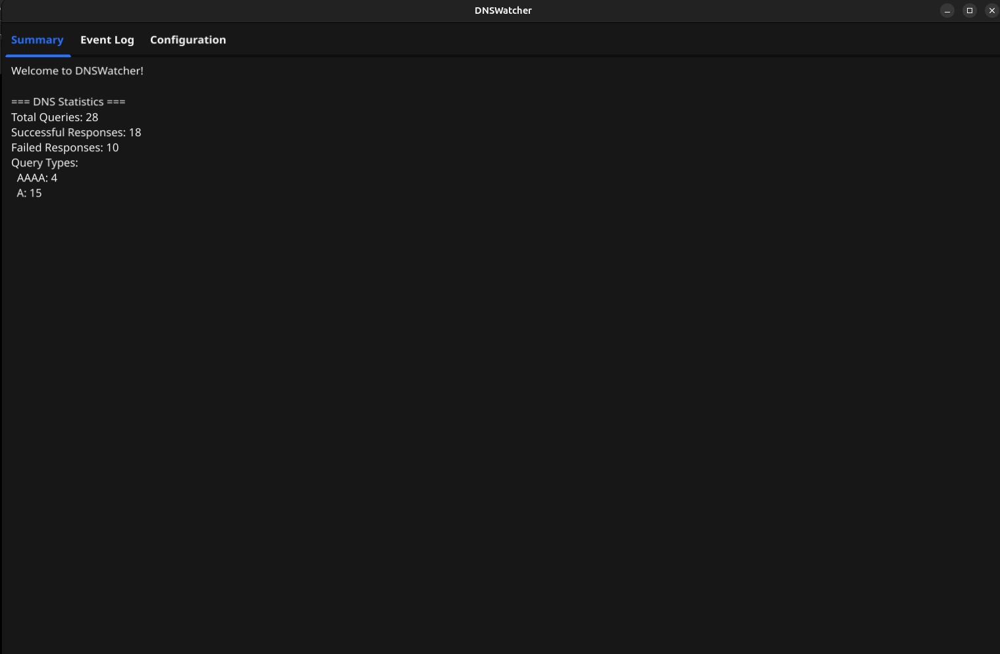
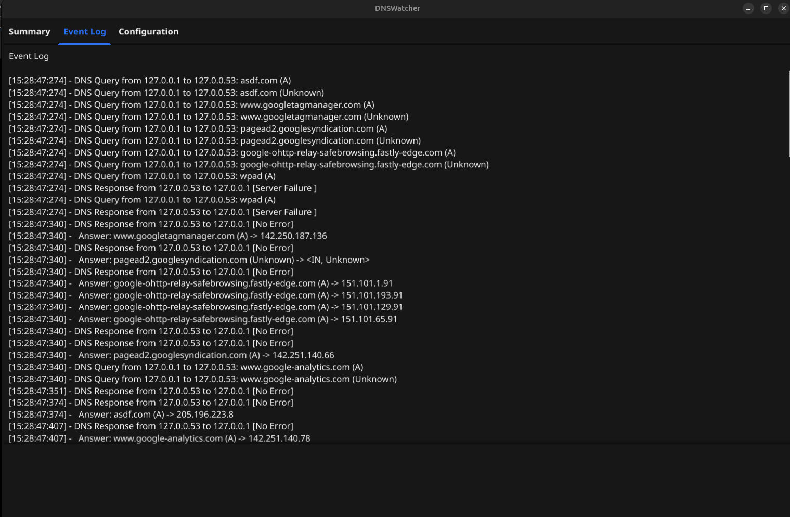
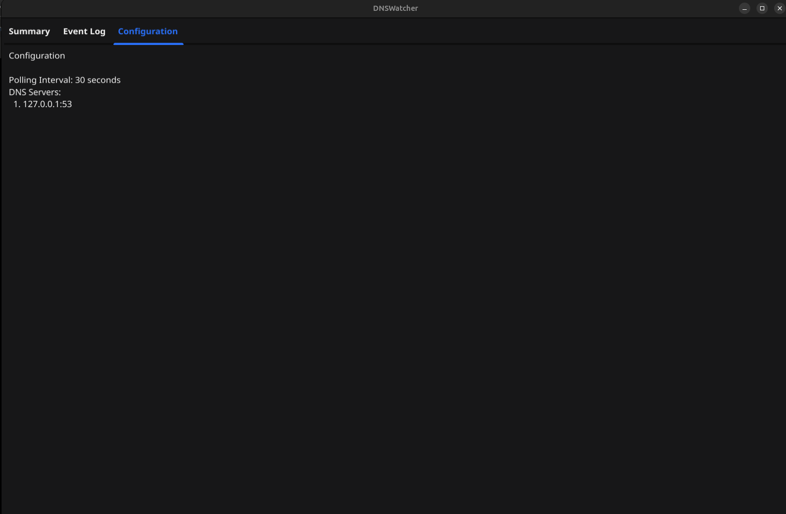

# DNSWatcher

DNSWatcher is a cross-platform DNS monitoring tool written in Go. It captures and analyzes DNS traffic in real time, tracks key performance indicators (KPIs), and provides both a command-line and a desktop GUI for visualization.

---

## Features

- **Real-time DNS Traffic Monitoring:**  
  Captures all DNS queries and responses on your network interface.
- **KPI Tracking:**  
  Tracks total queries, success/failure counts, query types, and unique domains.
- **Event Log:**  
  Maintains a scrollable, timestamped log of all DNS events.
- **Configurable:**  
  Easily adjust DNS servers and polling intervals via `config.yaml`.
- **Desktop GUI:**  
  Modern, tabbed interface built with [Fyne](https://fyne.io/).
- **CLI Mode:**  
  Run headless and see all output in your terminal.

---

## Screenshots

**Summary Tab**  
Shows live DNS KPIs and statistics.  


**Event Log Tab**  
Displays a scrollable, timestamped log of DNS events.  


**Config Tab**  
Shows the current configuration loaded from `config.yaml`.  


---

## Installation

1. **Clone the repository:**
   ```bash
   git clone https://github.com/yourusername/dns-watcher.git
   cd dns-watcher
   ```

2. **Install dependencies:**
   ```bash
   go mod tidy
   ```

3. **Install libpcap (Linux only, for packet capture):**
   ```bash
   sudo apt-get install libpcap-dev
   ```

---

## Configuration

Edit the `config.yaml` file to set your DNS server addresses and polling intervals.  
Example:

```yaml
dns_servers:
  - ip: "127.0.0.1"
    port: 53
polling_interval: 30
```

---

## Usage

### Run in CLI Mode

```bash
sudo go run cmd/main.go
```

### Run in GUI Mode

```bash
sudo go run cmd/main.go -gui
```

- In **GUI mode**, all logs are shown in the application, not in the terminal.
- In **CLI mode**, all output is printed to the terminal.

---

## Building Executables

### Build for Windows (.exe)

```bash
GOOS=windows GOARCH=amd64 go build -o dnswatcher.exe ./cmd/main.go
```

You can now run `dnswatcher.exe` on Windows.  
**Note:** For packet capture, you may need to run as Administrator and have WinPcap/Npcap installed.

---

### Build for Linux

```bash
go build -o dnswatcher ./cmd/main.go
```

Run with:

```bash
sudo ./dnswatcher
```
or for GUI mode:
```bash
sudo ./dnswatcher -gui
```

---

### Build for Other Platforms

You can cross-compile for other platforms by setting `GOOS` and `GOARCH` accordingly.  
See [Go's official documentation](https://golang.org/doc/install/source#environment) for details.

---

## Requirements

- Go 1.18+
- [Fyne](https://fyne.io/) (installed via `go mod tidy`)
- libpcap (Linux, for packet capture)
- (Windows) WinPcap or Npcap for packet capture

---

## License

This project is licensed under the MIT